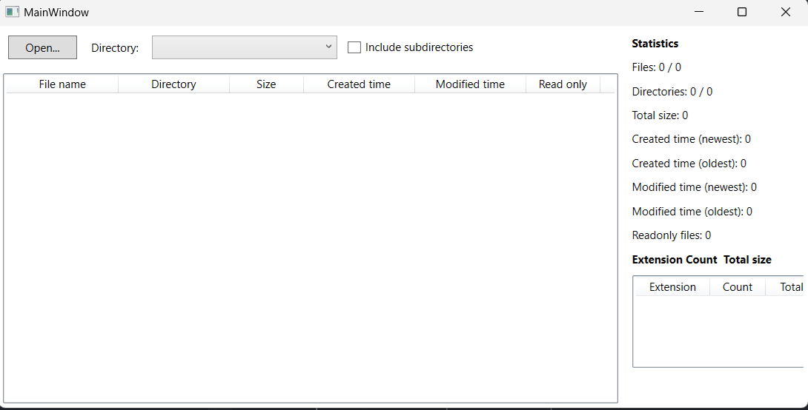

# 📂 File Statistics Filter

**File Statistics Filter** is a **C# and .NET application** developed as part of an **exam project**. It enables users to **search for files, extract metadata, and analyze historical file statistics**. The solution consists of:
- **Console Application** for file searching and metadata extraction.
- **WPF Desktop Application** for loading and analyzing CSV-based file statistics.
- **Class Library** for handling file metadata and data serialization.

---

## 🔍 Features
- **Search files in a directory** with optional recursive search.
- **Extract metadata** such as file size, creation/modification times, and file type.
- **Export data to CSV** for later analysis.
- **Load CSV data in WPF** and filter/search results dynamically.
- **Statistical summary** displaying:
  - Number of files and directories.
  - Total file size in human-readable format.
  - Oldest and newest file creation/modification timestamps.
  - Count of read-only files.
  - Distribution of file extensions with total size.

---

## 🛠️ Technologies Used
- **C# (.NET)**
- **WPF (Windows Presentation Foundation)**
- **Console Application**
- **File Handling & I/O**
- **CSV Data Processing**
- **LINQ for Data Filtering**
- **MVVM Architecture (WPF Application)**
- 
---

## 📸 Screenshots
Here are some screenshots of the WPF in action:

